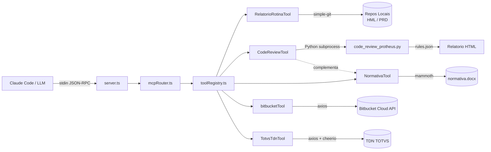

# MCP Protheus Expert


**Servidor MCP especializado para desenvolvimento TOTVS Protheus** — code review automatizado, analise de rotinas, consulta a normativa, documentacao TDN e integracao com versionadores.

> Projetado para **Claude Code** (CLI da Anthropic), mas compativel com qualquer LLM que suporte o protocolo MCP.
> A integracao de versionador utiliza **Bitbucket** como referencia, mas a arquitetura e adaptavel para **GitHub**, **GitLab**, **Azure DevOps** ou qualquer outro provedor.

---

## Indice

- [Sobre o Projeto](#sobre-o-projeto)
- [Arquitetura](#arquitetura)
- [Pre-requisitos](#pre-requisitos)
- [Instalacao](#instalacao)
- [Configuracao (.env)](#configuracao-env)
- [Configuracao no Claude Code](#configuracao-no-claude-code)
- [Ferramentas Disponiveis](#ferramentas-disponiveis)
  - [1. RelatorioRotinaTool](#1-relatoriorotina)
  - [2. Code Review Protheus](#2-code-review-protheus)
  - [3. Normativa](#3-normativa)
  - [4. Bitbucket Protheus](#4-bitbucket-protheus)
  - [5. Consulta TDN TOTVS](#5-consulta-tdn-totvs)
- [Regras do Code Review](#regras-do-code-review)
- [Estrutura do Projeto](#estrutura-do-projeto)
- [Adaptando para Outros LLMs](#adaptando-para-outros-llms)
- [Debug e Troubleshooting](#debug-e-troubleshooting)
- [Contribuindo](#contribuindo)
- [Autor](#autor)
- [Licenca](#licenca)

---

## Sobre o Projeto

O **MCP Protheus Expert** e um servidor que implementa o [Model Context Protocol (MCP)](https://modelcontextprotocol.io/) — um protocolo aberto que permite conectar modelos de IA a ferramentas externas via JSON-RPC sobre stdin/stdout.

Este projeto oferece **5 ferramentas especializadas** para o dia a dia de quem desenvolve no ERP TOTVS Protheus:

| Ferramenta | O que faz |
|------------|-----------|
| **RelatorioRotinaTool** | Analisa rotinas Protheus, gera relatorios Markdown com diagramas Mermaid e busca rotinas por tabela |
| **Code Review Protheus** | Executa code review automatizado com 24 regras, gera relatorio HTML interativo |
| **Normativa** | Consulta o documento normativo de desenvolvimento (.docx) |
| **Bitbucket Protheus** | Lista PRs abertos e commits de PRs (Bitbucket Cloud — adaptavel para outros versionadores) |
| **Consulta TDN** | Busca documentacao oficial de funcoes e classes no TDN TOTVS |

**Stack tecnologica:** TypeScript (servidor MCP) + Python (engine de code review)

---

## Arquitetura



**Fluxo:**
1. O Claude Code envia mensagens JSON-RPC via **stdin**
2. O `server.ts` recebe e repassa para o `mcpRouter.ts`
3. O roteador despacha para a ferramenta correta via `toolRegistry.ts`
4. A ferramenta executa e retorna o resultado via **stdout**

---

## Pre-requisitos

- **Node.js** 18 ou superior
- **npm** (incluido com o Node.js)
- **Python** 3.10 ou superior (para o code review)
- **Git** instalado e configurado
- **Repositorios Protheus clonados localmente** (HML e/ou PRD)
- **Credenciais do versionador** (Bitbucket App Password por padrao) — opcional, apenas para a ferramenta de integracao com versionador
- **Documento normativo** (.docx) — opcional, apenas para a ferramenta Normativa

---

## Instalacao

```bash
# 1. Clonar o repositorio
git clone https://github.com/Brunostng/mcp-protheus-expert.git
cd mcp-protheus-expert

# 2. Instalar dependencias
npm install

# 3. Compilar o TypeScript
npm run build

# 4. Configurar variaveis de ambiente
cp .env.example .env
# Edite o arquivo .env com seus caminhos e credenciais (veja secao abaixo)

# 5. (Opcional) Colocar documento normativo
# Copie seu arquivo .docx para a pasta normative/
```

---

## Configuracao (.env)

Copie o `.env.example` para `.env` e preencha conforme sua infraestrutura:

| Variavel | Obrigatoria | Descricao |
|----------|:-----------:|-----------|
| `REPO_HML` | Sim | Caminho local do repositorio de Homologacao |
| `REPO_PRD` | Sim | Caminho local do repositorio de Producao |
| `REPO_TOTVS_STANDARD` | Nao | Caminho do repositorio de fontes padrao TOTVS |
| `PYTHON_EXE` | Nao | Executavel Python (padrao: `python`) |
| `NORMATIVE_DOCX_PATH` | Nao | Caminho para o .docx da normativa (padrao: auto-detecta em `normative/`) |
| `BITBUCKET_USER` | * | Usuario do Bitbucket |
| `BITBUCKET_APP_PASSWORD` | * | App Password do Bitbucket |
| `BITBUCKET_WORKSPACE` | * | Workspace do Bitbucket |
| `BITBUCKET_REPO_HML` | * | Nome do repositorio HML no Bitbucket |
| `BITBUCKET_REPO_PRD` | * | Nome do repositorio PRD no Bitbucket |
| `ENABLE_FILE_CACHE` | Nao | Habilitar cache de arquivos (`true`/`false`) |
| `CACHE_TTL_SECONDS` | Nao | TTL do cache em segundos (padrao: `3600`) |
| `MCP_DEBUG` | Nao | `1` para ativar logs de debug via stderr |

> \* Obrigatorio apenas se utilizar a ferramenta `bitbucket_protheus`.

**Exemplo:**

```env
REPO_HML=C:\protheus\repositorio-hml
REPO_PRD=C:\protheus\repositorio-prd
REPO_TOTVS_STANDARD=C:\protheus\totvs-standard
PYTHON_EXE=python
NORMATIVE_DOCX_PATH=C:\protheus\docs\normativa_dev.docx
BITBUCKET_USER=meu.email@empresa.com
BITBUCKET_APP_PASSWORD=xxxxxxxxxxxxxxxxxxxx
BITBUCKET_WORKSPACE=minha-empresa
BITBUCKET_REPO_HML=protheus-hml
BITBUCKET_REPO_PRD=protheus-prd
MCP_DEBUG=1
```

---

## Configuracao no Claude Code

### Opcao 1: Via comando `claude mcp add` (recomendado)

```bash
claude mcp add mcp-protheus-expert \
  -e REPO_HML="C:\protheus\repositorio-hml" \
  -e REPO_PRD="C:\protheus\repositorio-prd" \
  -e PYTHON_EXE="python" \
  -e MCP_DEBUG="1" \
  -- node C:\caminho\para\mcp-protheus-expert\dist\server.js
```

### Opcao 2: Configuracao manual (Claude Desktop)

Adicione ao seu `claude_desktop_config.json`:

```json
{
  "mcpServers": {
    "mcp-protheus-expert": {
      "command": "node",
      "args": ["C:\\caminho\\para\\mcp-protheus-expert\\dist\\server.js"],
      "env": {
        "REPO_HML": "C:\\protheus\\repositorio-hml",
        "REPO_PRD": "C:\\protheus\\repositorio-prd",
        "REPO_TOTVS_STANDARD": "C:\\protheus\\totvs-standard",
        "PYTHON_EXE": "python",
        "NORMATIVE_DOCX_PATH": "C:\\protheus\\docs\\normativa_dev.docx",
        "BITBUCKET_USER": "seu_usuario",
        "BITBUCKET_APP_PASSWORD": "sua_app_password",
        "BITBUCKET_WORKSPACE": "seu_workspace",
        "BITBUCKET_REPO_HML": "protheus-hml",
        "BITBUCKET_REPO_PRD": "protheus-prd",
        "MCP_DEBUG": "1"
      }
    }
  }
}
```

### Verificando a conexao

Apos configurar, abra o Claude Code no diretorio do seu projeto Protheus. As ferramentas MCP ficam disponiveis automaticamente. Teste com:

```
"Liste as ferramentas MCP disponiveis"
```

---

## Ferramentas Disponiveis

### 1. RelatorioRotina

Analisa rotinas Protheus nos repositorios locais — encontra arquivos fonte, extrai estrutura (funcoes, tabelas, includes), gera relatorios Markdown com diagramas Mermaid e busca rotinas por tabela.

**Acoes disponiveis:**

| Action | Descricao |
|--------|-----------|
| `renderReportMarkdown` | Gera relatorio completo em Markdown com diagrama Mermaid (padrao) |
| `analyzeRoutine` | Analise estrutural: funcoes, includes, tabelas utilizadas |
| `getSourceCode` | Retorna o codigo-fonte da rotina |
| `status` | Status Git da rotina (diff comparando com branch base) |
| `searchByTable` | Busca todas as rotinas que utilizam uma tabela especifica |

**Parametros:**

| Parametro | Tipo | Padrao | Descricao |
|-----------|------|--------|-----------|
| `routine` | string | — | Nome da rotina (ex: `PCMCTF43`, `U_PCMACD05`) |
| `action` | string | `renderReportMarkdown` | Acao a executar |
| `env` | string | `AUTO` | Ambiente: `HML`, `PRD`, `TOTVS`, `STANDARD` ou `AUTO` |
| `baseBranch` | string | `origin/master` | Branch base para comparacao git |
| `includeSource` | boolean | `false` | Incluir codigo-fonte no relatorio Markdown |
| `mermaidMode` | string | `auto` | Modo Mermaid: `auto`, `confluence-safe` ou `off` |
| `sourceEncoding` | string | `latin1` | Encoding do fonte: `utf-8` ou `latin1` |
| `table` | string | — | Tabela para busca (action `searchByTable`) |
| `maxResults` | number | `50` | Limite de resultados na busca por tabela |
| `includeStandard` | boolean | `false` | Incluir rotinas padrao TOTVS na busca |

**Como usar no Claude Code:**

```
"Gere um relatorio da rotina U_PCMCTF43 no ambiente HML"

"Busque todas as rotinas que usam a tabela PD3"

"Me mostre o codigo-fonte da rotina MATA010"

"Qual o status git da rotina U_PCMACD05 comparando com origin/master?"

"Analise a estrutura da rotina PCMCTF43 em HML com o codigo-fonte incluso"
```

---

### 2. Code Review Protheus

Executa code review automatizado em uma branch, comparando com `origin/master`. Gera um **relatorio HTML interativo** com as violacoes encontradas, diferencia codigo legado de novas violacoes e complementa automaticamente com trechos da normativa.

**Parametros:**

| Parametro | Tipo | Obrigatorio | Padrao | Descricao |
|-----------|------|:-----------:|--------|-----------|
| `branch` | string | Sim | — | Branch para validar (ex: `SPCD-1946`) |
| `ambiente` | `HML` / `PRD` | Sim | — | Ambiente do repositorio |
| `incluirNormativa` | boolean | Nao | `true` | Complementar com trechos da normativa |

**Funcionalidades:**
- **24 regras** configuraveis em `python/rules.json`
- Deteccao de **codigo legado** (violacoes que ja existiam em `origin/master` nao sao contabilizadas)
- Deteccao de **conflitos de merge** via `git merge-tree`
- Relatorio HTML com filtros por severidade (ALTA / MEDIA / BAIXA)
- Integracao automatica com a ferramenta **Normativa** para buscar explicacoes das regras violadas

**Como usar no Claude Code:**

```
"Faca o code review da branch SPCD-1946 no ambiente HML"

"Execute code review da branch feature/nova-tela em PRD"

"Code review da branch SPCD-2100 em HML sem normativa"
```

---

### 3. Normativa

Consulta o documento normativo de desenvolvimento (.docx), extraindo apenas as **secoes 3 a 4.99** (regras de desenvolvimento). Utiliza score de relevancia para retornar os 5 trechos mais pertinentes a pergunta.

**Parametros:**

| Parametro | Tipo | Obrigatorio | Descricao |
|-----------|------|:-----------:|-----------|
| `question` | string | Sim | Pergunta sobre a normativa de desenvolvimento |

**Como usar no Claude Code:**

```
"O que a normativa diz sobre variaveis Private?"

"Qual a regra da normativa sobre nomes de funcoes?"

"O que diz a normativa sobre cabecalho Protheus.doc?"

"A normativa permite usar TcQuery?"

"Quais sao as regras de nomenclatura de variaveis?"
```

---

### 4. Bitbucket Protheus

Integra com a API do Bitbucket Cloud para listar PRs abertos e commits de PRs, selecionando o repositorio automaticamente pelo ambiente (HML ou PRD).

> **Adaptavel para outros versionadores:** A implementacao atual utiliza a API do Bitbucket Cloud como referencia, mas a arquitetura modular do projeto permite adaptar facilmente para **GitHub** (API REST/GraphQL), **GitLab** (API REST), **Azure DevOps** (API REST) ou qualquer outro provedor de repositorios Git. Basta criar uma nova ferramenta seguindo a interface `McpTool` e ajustar as chamadas de API conforme a documentacao do provedor desejado.

**Acoes:**

| Action | Descricao |
|--------|-----------|
| `list_open_prs` | Lista todos os Pull Requests abertos |
| `list_pr_commits` | Lista os commits de um PR especifico |

**Parametros:**

| Parametro | Tipo | Obrigatorio | Descricao |
|-----------|------|:-----------:|-----------|
| `ambiente` | `HML` / `PRD` | Sim | Ambiente do repositorio |
| `action` | string | Sim | `list_open_prs` ou `list_pr_commits` |
| `sourceBranch` | string | Nao | Filtrar por branch de origem |
| `targetBranch` | string | Nao | Filtrar por branch de destino |
| `prId` | number | Nao | ID do PR (para `list_pr_commits`) |

**Como usar no Claude Code:**

```
"Liste os PRs abertos no ambiente HML"

"Mostre os commits do PR 42 em PRD"

"Quais PRs abertos tem como destino a branch master em HML?"

"Liste os PRs da branch SPCD-1946 em HML"
```

---

### 5. Consulta TDN TOTVS

Consulta a documentacao oficial do [TDN (TOTVS Developer Network)](https://tdn.totvs.com/) para funcoes, classes e metodos do framework Protheus. Retorna explicacao nao-tecnica, descricao tecnica e exemplos de codigo.

**Parametros:**

| Parametro | Tipo | Obrigatorio | Descricao |
|-----------|------|:-----------:|-----------|
| `query` | string | Sim | Nome da funcao ou classe Protheus |

**Como usar no Claude Code:**

```
"Consulte no TDN sobre FwTemporaryTable"

"O que diz a documentacao oficial sobre FWFormView?"

"Busque no TDN informacoes sobre FWAdapterBase"

"Me explique a classe FWFormBrowse segundo o TDN"
```

---

## Regras do Code Review

O code review utiliza **24 regras** definidas em `python/rules.json`. Cada regra possui severidade (ALTA, MEDIA ou BAIXA) e pode usar `regex` ou `contains` para deteccao:

| ID | Severidade | Descricao |
|----|:----------:|-----------|
| 3.1 | BAIXA | Cabecalho Protheus.doc obrigatorio nas rotinas |
| 3.3 | BAIXA | Nao deixar trechos de codigo comentado |
| 3.4 | BAIXA | Maximo 250 caracteres por linha |
| 3.16 | ALTA | Nao usar macro substituicao `&()` — usar FieldPut/FieldGet |
| 3.17-1 | ALTA | Nao utilizar `EVal()` |
| 3.17-2 | ALTA | Nao utilizar `aEval()` |
| 3.17-3 | ALTA | Nao utilizar `dbEval()` |
| 3.19 | MEDIA | Fonte com classes deve ter User Function dummy |
| 3.20 | MEDIA | Em classes, usar `self:Prop` ao inves de `::Prop` |
| 3.21-1 | ALTA | Nao usar variavel `Public` |
| 3.21-2 | ALTA | Nao usar variavel `Static` no escopo global |
| 3.21-3 | ALTA | Uso de `Private` deve ser justificado |
| 3.23 | ALTA | Nome de variavel com maximo 10 caracteres |
| 3.25 | ALTA | User Function com maximo 8 caracteres (sem contar `U_`) |
| 3.27 | ALTA | Static Function com maximo 10 caracteres |
| 3.28 | ALTA | Nao utilizar `StaticCall()` |
| 3.32 | ALTA | Nao acessar tabelas SX* diretamente (dicionario de dados) |
| 3.42 | ALTA | Funcoes obsoletas: AXCadastro, AXAltera, AXDelete, NewGetDados, CriaTrab, DbSetFilter |
| 3.46 | ALTA | Nao usar `TCSqlExec()` para Insert/Update/Delete |
| 3.52 | ALTA | Nao usar `SELECT *` em queries |
| 3.59 | ALTA | Nao usar `D_E_L_E_T_ = ''` (Oracle interpreta como NULL) |
| 3.74 | ALTA | Nao usar `TcQuery()` — usar DbUseArea + TcGenQry ou Embedded SQL |
| 4.1 | MEDIA | Paths Windows `\\` sem tratamento `IsSrvUnix()` |

> As regras sao configuraveis editando o arquivo `python/rules.json`. Cada regra suporta os tipos de match `regex` e `contains`.

---

## Estrutura do Projeto

```
mcp-protheus-expert/
├── src/
│   ├── server.ts                    # Ponto de entrada MCP (stdin/stdout)
│   ├── mcpRouter.ts                 # Roteador JSON-RPC (initialize, tools/list, tools/call)
│   ├── toolRegistry.ts              # Registro central das 5 ferramentas
│   ├── types/
│   │   └── McpTool.ts               # Interface McpTool (name, description, run, inputSchema)
│   └── tools/
│       ├── RelatorioRotinaTool.ts    # Analise de rotinas e relatorios Markdown/Mermaid
│       ├── CodeReviewTool.ts         # Code review com integracao Python + normativa
│       ├── NormativaTool.ts          # Consulta normativa (.docx)
│       ├── bitbucketTool.ts          # Integracao Bitbucket Cloud API
│       └── TotvsTdnTool.ts           # Consulta TDN TOTVS (web scraping)
├── python/
│   ├── code_review_protheus.py      # Engine de code review (24 regras, relatorio HTML)
│   └── rules.json                   # Regras de validacao configuraveis
├── normative/
│   └── (seu_arquivo_normativa.docx)  # Documento normativo (nao versionado)
├── dist/                             # Build compilado (gerado por npm run build)
├── .env.example                      # Template de variaveis de ambiente
├── package.json                      # Dependencias e scripts npm
└── tsconfig.json                     # Configuracao TypeScript
```

---

## Adaptando para Outros LLMs

O MCP e um **protocolo aberto e universal**. Qualquer cliente que implemente JSON-RPC sobre stdin/stdout pode utilizar este servidor. O Claude Code e o cliente principal, mas voce pode adaptar para qualquer LLM.

### Testando manualmente via terminal

Inicie o servidor e envie mensagens JSON-RPC:

```bash
# Inicializar conexao
echo '{"jsonrpc":"2.0","id":1,"method":"initialize","params":{"protocolVersion":"2025-06-18","capabilities":{},"clientInfo":{"name":"test","version":"1.0.0"}}}' | node dist/server.js
```

```bash
# Listar ferramentas disponiveis
echo '{"jsonrpc":"2.0","id":2,"method":"tools/list"}' | node dist/server.js
```

```bash
# Chamar uma ferramenta (exemplo: consulta TDN)
echo '{"jsonrpc":"2.0","id":3,"method":"tools/call","params":{"name":"Totvs_Tdn_Consulta","arguments":{"query":"FwTemporaryTable"}}}' | node dist/server.js
```

### Integrando com outros clientes MCP

O servidor utiliza o transporte **stdio** (stdin/stdout). Para integrar com qualquer outro LLM:

1. Inicie o processo: `node dist/server.js`
2. Envie `initialize` via stdin
3. Envie `tools/list` para descobrir as ferramentas
4. Envie `tools/call` com o nome da ferramenta e argumentos
5. Leia as respostas JSON-RPC via stdout

> Consulte a [especificacao MCP](https://modelcontextprotocol.io/) para detalhes do protocolo.

---

## Debug e Troubleshooting

### Ativando logs de debug

Defina `MCP_DEBUG=1` no `.env`. Os logs sao enviados para **stderr** (nunca para stdout, que e reservado ao protocolo MCP).

### Problemas comuns

| Problema | Solucao |
|----------|---------|
| `Python not found` | Verifique se `PYTHON_EXE` aponta para o executavel correto |
| `Repository path not found` | Confira os caminhos `REPO_HML` e `REPO_PRD` no `.env` |
| `DOCX not found` | Coloque o .docx na pasta `normative/` ou defina `NORMATIVE_DOCX_PATH` |
| `Bitbucket 401 Unauthorized` | Gere um novo App Password em Bitbucket > Settings > App passwords |
| `Encoding errors` | Tente alterar `sourceEncoding` para `utf-8` ou `latin1` |
| Ferramenta nao aparece no Claude | Verifique se `npm run build` foi executado e o caminho no config esta correto |

---

## Contribuindo

Contribuicoes sao bem-vindas! Para adicionar funcionalidades:

### Adicionando uma nova ferramenta MCP

1. Crie um arquivo em `src/tools/SuaFerramenta.ts` implementando a interface `McpTool`:

```typescript
import { McpTool } from "../types/McpTool.js";

const suaFerramenta: McpTool = {
  name: "nome_da_ferramenta",
  description: "Descricao da ferramenta",
  inputSchema: {
    type: "object",
    properties: {
      parametro: { type: "string", description: "Descricao do parametro" }
    },
    required: ["parametro"]
  },
  async run(input) {
    // Sua logica aqui
    return { ok: true, resultado: "..." };
  }
};

export default suaFerramenta;
```

2. Registre em `src/toolRegistry.ts`:

```typescript
import suaFerramenta from "./tools/SuaFerramenta.js";
// Adicione ao array de ferramentas
```

3. Compile com `npm run build`

### Adaptando o versionador (GitHub, GitLab, Azure DevOps)

A ferramenta `bitbucket_protheus` foi construida para Bitbucket Cloud, mas voce pode criar uma versao para outro provedor. O fluxo e simples:

1. Duplique `src/tools/bitbucketTool.ts` como base (ex: `githubTool.ts`)
2. Substitua as chamadas da API do Bitbucket pelas do provedor desejado:
   - **GitHub:** `https://api.github.com/repos/{owner}/{repo}/pulls`
   - **GitLab:** `https://gitlab.com/api/v4/projects/{id}/merge_requests`
   - **Azure DevOps:** `https://dev.azure.com/{org}/{project}/_apis/git/repositories/{repo}/pullrequests`
3. Ajuste a autenticacao (token Bearer, PAT, etc.)
4. Registre a nova ferramenta em `src/toolRegistry.ts`
5. Adicione as variaveis de ambiente correspondentes no `.env`

### Adicionando regras de code review

Adicione um novo objeto ao array em `python/rules.json`:

```json
{
  "id": "Normativa X.Y",
  "severidade": "ALTA",
  "descricao": "Descricao da regra",
  "linguagem": "advpl",
  "alvo": "added",
  "match": "regex",
  "padrao": "seu_pattern_aqui"
}
```

---

## Autor

Desenvolvido por **Bruno Santana Gomes** — [@Brunostng](https://github.com/Brunostng)

---

## Licenca

Este projeto esta licenciado sob a licenca MIT. Consulte o arquivo [LICENSE](LICENSE) para mais detalhes.
